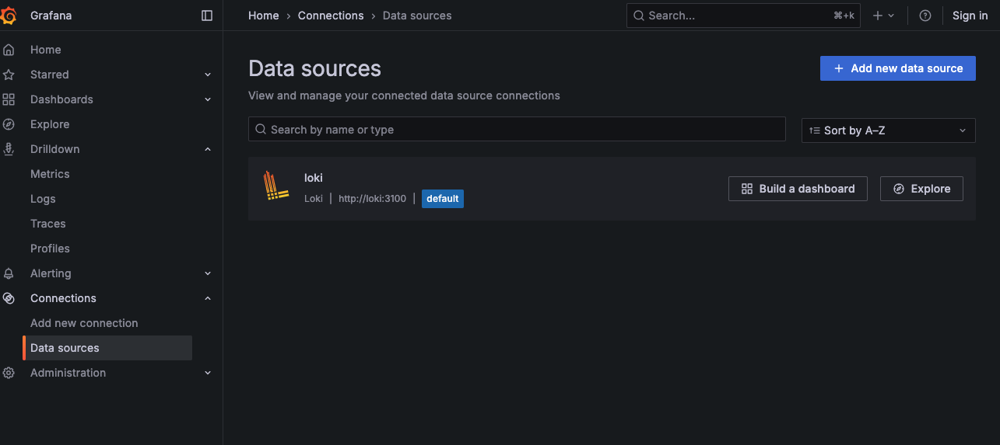
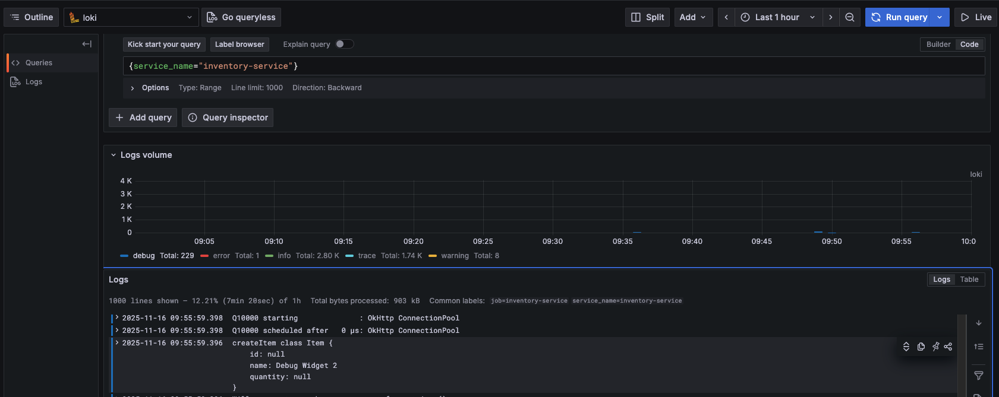

# Local Development Environment

This directory contains the necessary configuration to run the application and its dependencies in a local Docker environment.

## Running the Environment

To start the local development environment, navigate to this directory in your terminal and run the following command:

```
 docker-compose up -d
```

This will start the application along with the services defined in the `docker-compose.yml` file.

To stop the environment, run the following command from this directory:

```
 docker-compose down -v
```

To view the Jaeger Service UI you can open a browser at http://localhost:16686/search

## Running the Inventory Service locally
Once the docker environment is started, you can open a terminal at the project root and run:

```
 mvn clean install
```
to build.

You then can run the service locally by typing:
```
 mvn spring-boot:run
```

Note the default logging in `application.yml` is quite verbose 


## Viewing the Inventory Service trace and logs
Once the docker environment is started, you can open a terminal at the project root and run:

To view the trace from Inventory Service, you should open the Jaeger Service UI at http://localhost:16686/search and select `inventory-service` from the `Services` dropdown.


To add a trace for create-item, open a terminal window and run:

```
curl -v -X POST http://localhost:8080/api/items \
-H "Content-Type: application/json" \
-H "correlation-id: testcorrelationID" \
-d '{
"name": "Debug Widget co id",
"sku": "DEBUG-003",
"price": 9.99,
"quantity": 50
}'
```

You can then access the details for this service call in the UI.


To view the logs from Inventory Service, you should open Grafana at http://localhost:3001 (default username/password: admin/admin).

You must first add Loki as a data source in Grafana:
- Go to **Configuration** (gear icon) -> **Data Sources** -> **Add data source**
- Select **Loki** from the list
- Set the URL to `http://loki:3100` and click **Save & Test**




Next, in Grafana, you can use the following LogQL query to filter logs for `{service_name="inventory-service"}`.



You 